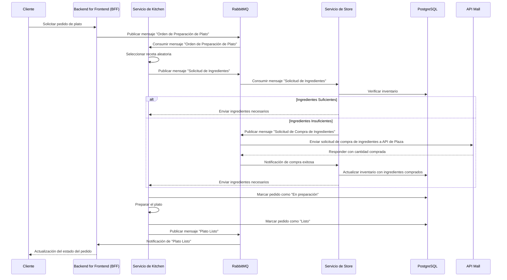

# Prueba Técnica Alegra: Gestión Pedidos de kitchen 🍽️
### Reto: 💥 Jornada de almuerzo ¡Gratis!

Este proyecto implementa una aplicación de pedidos para un restaurante, utilizando una **arquitectura de microservicios**. La aplicación permite:
- Hacer pedidos de platos aleatorios.
- Consultar stock de ingredientes.
- Gestionar la compra de ingredientes faltantes.

## Arquitectura
El proyecto consta de los siguientes microservicios:
- **BFF (Backend for Frontend):** Interfaz que maneja las peticiones del cliente.
- **Kitchen:** Selecciona aleatoriamente las recetas y prepara los platos.
- **Store:** Gestiona el inventario de ingredientes, reponiéndolos si es necesario.
- **Mall:** Se conecta a una API externa para comprar ingredientes.

## Requisitos
- Docker y Docker Compose.
- PHP y Laravel.

## Diagrama de secuencia inicial
