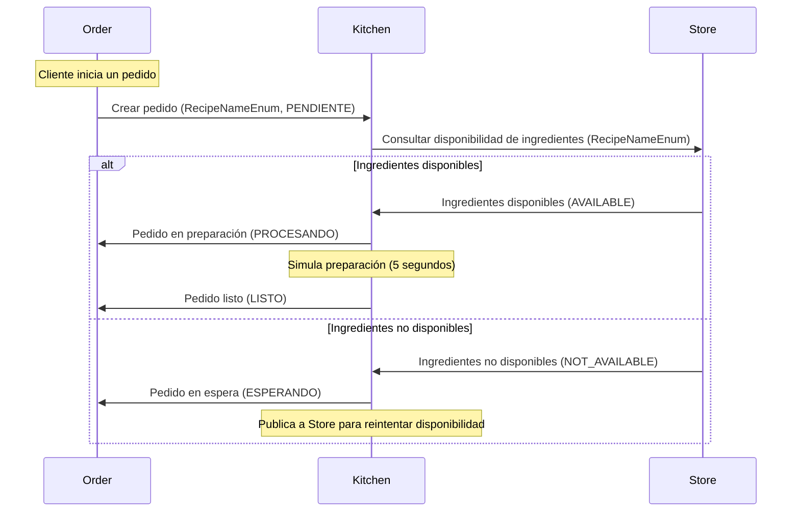

# Prueba Técnica Alegra: Gestión Pedidos de kitchen 🍽️
## Reto: 💥 Jornada de almuerzo ¡Gratis!

Este proyecto implementa una aplicación de pedidos para un restaurante, utilizando una **arquitectura de microservicios**. La aplicación permite:
- Hacer pedidos de platos aleatorios.
- Consultar stock de ingredientes.
- Gestionar la compra de ingredientes faltantes.

## Arquitectura
El proyecto consta de los siguientes microservicios:
- **Order:** Se encarga de recibir la peticion de un pedido, y manejar el estado de los pedidos.
- **Kitchen:** Selecciona aleatoriamente las recetas y prepara los platos, se comunica con `Store` para validar disponibilidad.
- **Store:** Gestiona el inventario de ingredientes, reponiéndolos si es necesario.

## Requisitos
- Docker y Docker Compose.
- PHP y Laravel.

## Diagrama de secuencia inicial
Se ha simplificado por ahora la funcionalidad de las aplicaciones, fundamentalmente realizaran estas operaciones, pemitiendo escalar verticalmente en el futuro.


## Comandos de incializacion

### 1. Crear Contenedor Orquestador
    Desde la raíz del proyecto, construye y ejecuta el contenedor que desplegará la aplicación completa:
    ```bash
    docker build -t alegra .
    docker run -d --rm -v /var/run/docker.sock:/var/run/docker.sock alegra
    ```
### 2. Configurar Archivos `.env`
    Copia los archivos de ejemplo .env.example para cada microservicio:
    ```bash
    cp microservices/order/.env.example microservices/order/.env
    cp microservices/kitchen/.env.example microservices/kitchen/.env
    cp microservices/store/.env.example microservices/store/.env
    ```
### 3. Iniciar Microservicios
    Ejecuta los siguientes comandos para construir y desplegar cada microservicio, queda pendiente mejorar esto en el orquestador:
    ```bash
    cd ./microservices/order/ && docker compose up --build -d
    cd ./microservices/kitchen/ && docker compose up --build -
    cd ./microservices/store/ && docker compose up --build -d
    ```
    RabbitMQ se inicializa automáticamente mediante el contenedor orquestador, y la red Docker compartida.


### Estructura de microservicios
- [Revisión general del directorio y archivos del microservicio Order](microservices/order/docs/project-structure.md)
- [Revisión general del directorio y archivos del microservicio Kitchen](microservices/kitchen/docs/project-structure.md)
- [Revisión general del directorio y archivos del microservicio Store](microservices/store/docs/project-structure.md)